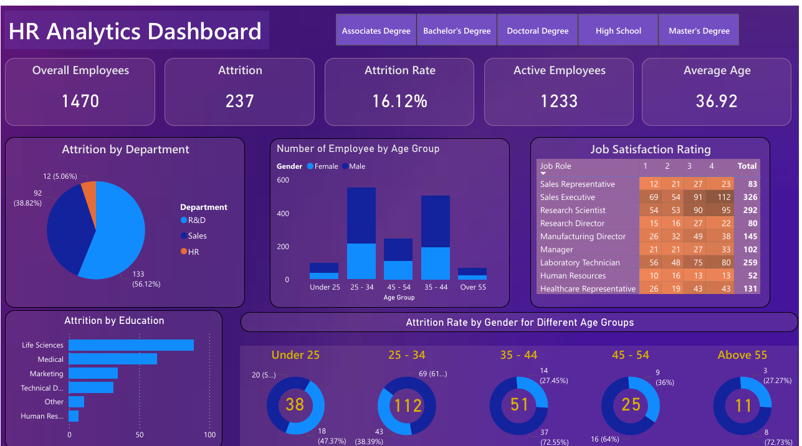

# HR Analytics Dashboard – Employee Attrition Analysis (Power BI)

## Project Overview

This project is an **HR Analytics Dashboard** built using **Microsoft Power BI** to analyze employee attrition patterns and workforce demographics.

The dashboard helps HR teams and business leaders understand:

- Why employees are leaving  
- Which departments are most affected  
- Attrition trends across age, gender, education, and job roles  
- Employee satisfaction distribution  

The goal is to provide actionable insights that support **retention strategies and workforce planning**.

---

## Business Objective

Employee attrition is costly and impacts productivity.

This dashboard aims to:

- Monitor attrition rate across the organization  
- Identify high-risk employee segments  
- Understand key factors influencing turnover  
- Support data-driven HR decision-making  

---

## Dataset Information

The analysis is based on an HR dataset containing employee records such as:

- Age group  
- Gender  
- Department  
- Job role  
- Education background  
- Job satisfaction rating  
- Attrition status  

Dataset file: `HR Data.xlsx`

---

## Key KPIs Tracked

The dashboard provides a quick overview of major HR metrics:

| Metric | Value |
|-------|------|
| Total Employees | **1470** |
| Total Attrition | **237** |
| Attrition Rate | **16.12%** |
| Active Employees | **1233** |
| Average Employee Age | **36.92** |

(Source: Dashboard summary)

---

## Dashboard Insights

### Attrition by Department
- Highest attrition observed in **R&D**, followed by **Sales**
- HR department shows the lowest attrition share

### Employee Age Distribution
- Majority of employees fall in the **25–34** and **35–44** age groups
- Attrition is more prominent among younger employees

### Attrition by Education Background
- Employees from **Life Sciences** and **Medical** education fields show higher attrition

### Job Satisfaction by Role
- Job satisfaction ratings vary significantly across roles such as:
  - Sales Executive  
  - Research Scientist  
  - Laboratory Technician  

### Gender & Age-Based Attrition
- Attrition trends differ by gender across age groups, especially in the **25–34** bracket

---

## Tools & Technologies Used

- **Power BI Desktop** – Dashboard development  
- **Power Query** – Data cleaning and transformation  
- **DAX** – KPI calculations and measures  
- **Data Modeling** – Relationship building and report structuring  

---

## Project Files

powerbi-hr-analytics-dashboard/  
│── HR Analytics Project.pbix  
│── HR Data.xlsx  
│── README.md  
└── Images/
    └── dashboard.png  

---

## Dashboard Preview

*Export the dashboard screenshot from Power BI and save it as `dashboard.png` in the repository.*

---

## How to Use This Project

1. Download or clone this repository  
2. Open the Power BI file:  
   `HR Analytics Project.pbix`

3. Ensure the dataset file is in the same folder:  
   `HR Data.xlsx`

4. Refresh data inside Power BI to explore the dashboard interactively  

---

## Author

**Vaibhav Adlakha** 
